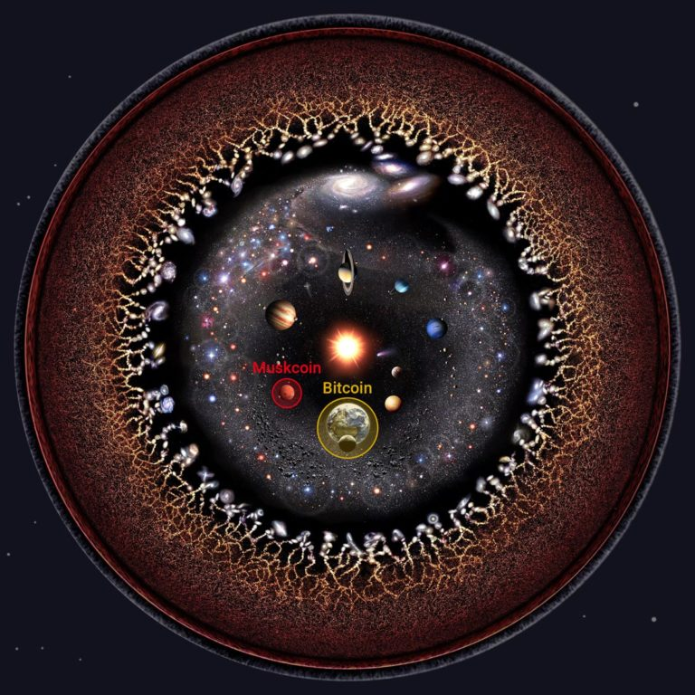
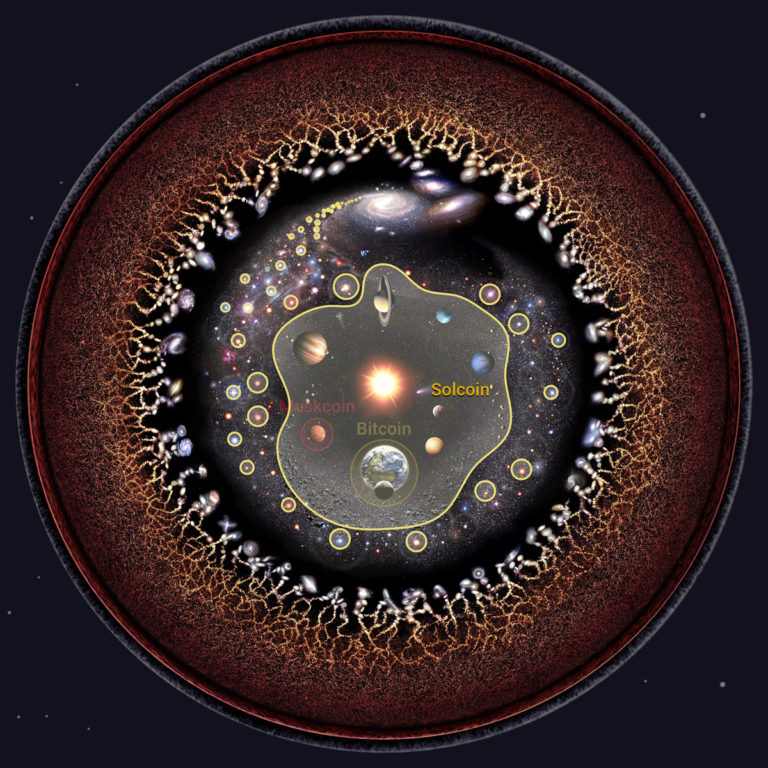
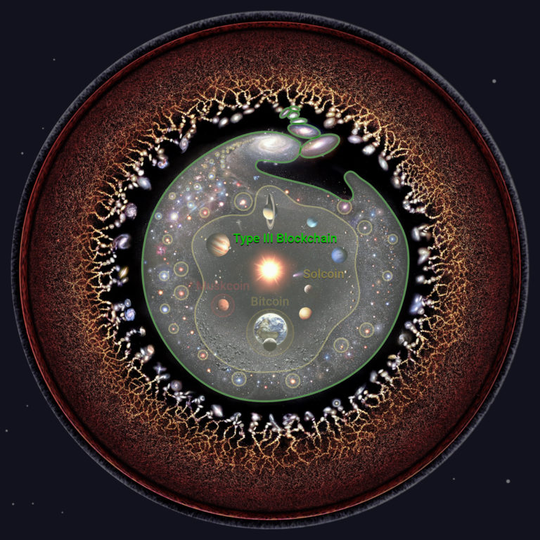

<header>

  
  


</header>

<head>
<meta name="viewport" content="width=device-width, initial-scale=1">

</head>

This is 🇨🇿 Czech translation of <a href="https://bitcoinmagazine.com/business/bitcoin-mining-at-nuclear-power-plants">this article</a> 
by <a href="https://twitter.com/purugyl">Puru Goyal</a> & Tina Torres, published on Jul12/2022 
<a href="https://twitter.com/BitcoinMagazine">@BitcoinMagazine</a> / Translated with 🧡 @745935 by <a href="https://twitter.com/nekonecnik">@nekonecnik</a> 

# Bitcoinová astronomie - Část II

Toto je druhá část série spekulací o bitcoinizované budoucnosti.  V <a href="">první části</a> jsme definovali první zákon bitcoinové astronomie a popsali, jak motivuje k hledání energie pro pohánění naší rostoucí civilizace.

V této části budeme pokračovat ve sledování energie a spekulovat o tom, jak se peníze a společnost vyvíjejí společně s tím, jak lidstvo expanduje vesmírem.  Začneme stručným přehledem části I.

---

### První zákon jeden na jednoho (zblízka)

V první části jsme spekulovali o bitcoinizovaném lidstvu, kde se bitcoin stal něčím mnohem víc než jen měnou nebo dokonce globálním finančním systémem.  V budoucnu je bitcoin hluboce integrován do energetiky, telekomunikací, logistiky a dalších odvětví pozemské ekonomiky.  Sekundární a terciární vrstvy sítí usazené do bitcoinu jsou způsobem, jakým se organizují trhy, dodavatelské řetězce i politické systémy.

IMG 01-03-center-of-hash.png
<small>" Střed hashování " byl definován v <a href="">první části</a> této série.</small>

Lidstvo začíná osidlovat i jiné planety, například Mars.  To nás přivedlo ke zkoumání toho, jak bitcoin funguje, když uživatele a těžaře dělí velké vzdálenosti.  Představili jsme myšlenku středu hashování (výše) a vysvětlili, jak vede k prvnímu zákonu bitcoinové astronomie: těžba proof-of-work není proveditelná daleko od středu hašování blockchainu.  Všichni těžaři daného blockchainu musí být společně rozmístěni ve stejném hashovacím horizontu - prostorové kouli o průměru srovnatelném se vzdáleností, kterou může světlo urazit za dobu trvání bloku daného blockchainu.  Volba 10minutové doby bloku, kterou Bitcoin zvolil, staví Mars (v průměrné vzdálenosti 12 světelných minut) mimo hashovací horizont Země.  Marťané budou moci bitcoin používat, ale nikdy ho nebudou těžit!

Těžba je jedním z nejdůležitějších odvětví bitcoinizované budoucnosti.  Nejde jen o získávání poplatků za vypořádání transakcí - kdokoli může přeměnit energii přímo na peníze, což motivuje k rozsáhlejšímu získávání energie a optimalizuje její distribuci.  V touze nastartovat tento blahodárný cyklus (a vlnu finančních spekulací) spustí vzdálené kolonie vlastní blockchainy podobné bitcoinu.

Sledovali jsme spuštění Muskcoinu, prvního z těchto blockchainů, na planetě Mars.  Spuštění Muskcoinu je svého druhu ekonomickou a politickou revolucí.  Terranští těžaři jej nepodpoří, raději si nechají marťanské transakční poplatky kumulovat na Zemi.  První zákon bitcoinové astronomie je důvodem, proč Marťané Muskcoin spustí, ale bude také důvodem, proč Muskcoin přežije; terranští těžaři jsou příliš daleko od centra hashování Muskcoinu, aby mu zabránili stát se novou měnou Rudé planety.

Tento vzorec expanze a revoluce se bude v budoucnu opakovat.  Vzhledem k tomu, že naši civilizaci dělí velké vzdálenosti, první zákon zajišťuje, že ti na okraji budou mít motivaci i schopnost spustit vlastní blockchainy.  Tito průkopníci budou osidlovat vnější planety a nakonec i blízké hvězdy, prostě proto, že jsou daleko.

### Kardašovovy civilizace

Než budeme pokračovat v našich úvahách, bude užitečné zavést určitou terminologii pro popis civilizací podle jejich spotřeby energie. <a href="https://www.centauri-dreams.org/2014/03/21/what-kardashev-really-said/">Slavná stupnice</a> Nikolaje Kardašova rozděluje civilizace do následujících kategorií:

- Civilizace typu I (planetární civilizace) spotřebovává energii planetárního rozsahu (cca 1017 wattů).
- Civilizace typu II (hvězdná civilizace) spotřebovává energii hvězdného rozsahu ( cca 1026 wattů).
- Civilizace typu III: (galaktická civilizace) spotřebovává energii galaktického rozsahu (cca 1037 wattů).

IMG 0201 kardash

Tato stupnice není přesná a je více než trochu náhodná, ale proporcionálně vystihuje obrovský rozdíl ve spotřebě energie mezi civilizacemi různých typů: například hvězdná civilizace typu II spotřebuje miliardkrát více energie než planetární civilizace typu I.  Původní tři kategorie byly později rozšířeny (typ IV, typ V atd.) a interpolovány. Například civilizace typu 2.1 by spotřebovala více energie než hvězdná civilizace typu II, ale méně než galaktická civilizace typu III.

Sci-fi často popisuje fantastické megaprojekty vyspělých civilizací, jako jsou vesmírné výtahy a Dysonovy sféry, ale jen zřídkakdy popisuje, *jak to všechno financují*.  Jak mohou peníze dosáhnout koordinace společnosti napříč slunečními soustavami a galaxiemi?  Jak velký trh je zapotřebí k vypořádání prodeje hvězdné soustavy?  Jakou rezervní měnu by si vybral nesmrtelný investor budoucnosti?  Tyto otázky většina autorů science fiction ignoruje a považuje peníze buď za nezajímavé, protože jsou stejné jako ty dnešní, nebo za irelevantní, protože v budoucnosti neexistuje vzácnost.

> <b>...pokud se ukáže, že vaše teorie odporuje druhému termodynamickému zákonu, nemohu vám dát žádnou naději; nezbývá než ji v nejhlubším ponížení zavrhnout.</b>
>  SIR ARTHUR EDDINGTON

Věříme, že termodynamické zákony jsou nedotknutelné. Energie bude vždy vzácná a při jejím využívání bude vždy vznikat entropie v podobě odpadního tepla. Jedinou veličinou ve vesmíru s nekonečnou zásobou jsou lidské ambice. V žádné budoucí společnosti proto nikdy nevymizí vzácnost. Pro lidstvo to znamená, že peníze a trhy - a tedy i blockchainy - budou pro optimalizaci shromažďování, distribuce a alokace zdrojů vždy užitečné.

### Kardašovovy blockchainy

Jsme přesvědčeni, že peníze budou škálovat se spotřebou energie ve společnosti.

Dnes, na úsvitu bitcoinu, jsme (podle <a href="https://en.wikipedia.org/wiki/Kardashev_scale#cite_note-books.google.com-4">některých měřítek</a>) "subplanetární" civilizací typu 0,7.  V době Muskcoinové revoluce se naše vzkvétající meziplanetární civilizace dostane na Kardaševově stupnici někam mezi typ I a II, ovšem mnohem blíže k typu I.

Jak budeme pokračovat ve vývoji civilizace typu II, přerosteme "planetární blockchainy" typu I, jako je bitcoin nebo Muskcoin.  Tyto měny budeme stále oceňovat, ale vytvoříme nový, *hvězdný (stellar) blockchain*, který bude pokrývat celou naši sluneční soustavu.  Tento blockchain typu II budeme nazývat Solcoin, protože se začne používat pro většinu obchodů probíhajících na oběžné dráze hvězdy Sol, našeho Slunce.

Peníze však pouze neškálují v reakci na spotřebu energie ve společnosti, ale *způsobují ji*: blockchainy vyššího typu posouvají civilizace nižšího typu nahoru po Kardašovově stupnici.  Bitcoin byl blockchain typu I vytvořený civilizací typu 0,7.  Motivoval k získávání energie v blízkosti Země, což nás pohánělo na oběžnou dráhu a do sluneční soustavy směrem k tomu, abychom se stali civilizací typu I.  Solcoin je blockchain typu II vybudovaný civilizací typu 1.x.  Bude motivovat k využívání energie v celé sluneční soustavě, pohánět megastruktury a mezihvězdné mise, což umožní našemu druhu expandovat napříč galaktickým prostorem.

Až lidstvo nakonec dosáhne dalších hvězd, spustíme blockchainy i tam - nejprve planetární, pak hvězdné.  Naše případná mezihvězdná společnost typu 2.x spustí *galaktické blockchainy* typu III.  Tato pozitivní zpětná vazba mezi expandujícími společnostmi a novými blockchainy se bude opakovat ve stále větších měřítcích určených rozložením hmoty ve vesmíru.

Náš příběh začneme vznikem Solcoinu na kdysi velké planetě Zemi, někdy po Muskoinové revoluci.

## Civilizace typu I spouštějí blockchainy typu II

Muskoinská revoluce byla pro mnoho Terranů šokem.  Země byla nejstarším, nejlidnatějším a nejrozvinutějším světem a hashrate terranských těžařů byl obrovský.  Přesto se Mars, malá kolonie, která by bez pokračujících investic a výživy ze Země neuspěla, úspěšně vzbouřil proti bitcoinu.

Klíčovým faktorem úspěchu této revoluce byla volba Marťanů, kteří zvolili dostatečně krátkou dobu bloku, aby se Země ocitla mimo hashovací horizont Muskcoinu a zabránili tak pozemským minerům těžit Muskcoin.  Kdyby se Marťané rozhodli obdařit Muskcoin několikahodinovou dobou bloku, Země by se ocitla v hash horizontu Muskcoinu.  Masivně větší terranský hashrate by překonal marťanské těžaře, což by jim umožnilo hashovat Muskcoin a zničit jej i revoluci bez jediného výstřelu.

> <b>Krátké časy bloků jsou formou ekonomického protekcionismu, který umožňuje omezení rychlostí světla.</b>

Marťané a další potenciální revolucionáři tento vztah intuitivně chápou: krátké doby bloků umožňují začínajícím blockchainům bránit se proti drancování mocnými etablovanými hráči.  Dlouhé doby bloků nejenže činí sekundární a terciární vrstvy ekonomiky založené na blockchainu inženýrsky náročnějšími, ale také přenechávají moc vzdáleným zájmům.  Žádná revoluce by nebyla tak hloupá, aby začala blockchain s dlouhou dobou bloku.

### Úpadek a zánik pozemského impéria (The Decline and Fall of the Terran Empire)

Ale co impérium?

Stejně jako americká revoluce o několik století dříve se i Muskoinová revoluce stala vzorem pro ostatní kolonie usilující o nezávislost na terranské ekonomické a politické kontrole.  Mocné zájmy na Zemi, stejně jako předtím Britské impérium, čelí vyhlídce na neustálé snižování vlivu, protože vzdálené kolonie rostou a inspirovány příkladem Marsu požadují svou nezávislost.

Chytří pozemšťané si uvědomí, že blockchain s dlouhou dobou bloku může být přesně to, co je potřeba k omezení budoucích revolucí.  Marťané používali bitcoin na Marsu mnoho let předtím, než spustili Muskcoin; právě nemožnost těžit bitcoin a absence pozitivního těžebního cyklu vyvolala revoluci.

Většina hmoty sluneční soustavy se nachází ve vzdálenosti jednoho světelného dne od Země.  Pokud by Terrané spustili blockchain s dobou bloku několika dní, jeho hash horizont by zahrnoval všechny těžaře v celé sluneční soustavě.  To je povede k návrhu Solcoinu, prvního hvězdného blockchainu typu II.

Pozemšťané doufají, že Solcoin promění potenciální koloniální revolucionáře v produktivní těžaře, kteří budou společně těžit na jediném trhu v celé sluneční soustavě.  Tvrdí, že jediné peníze jsou efektivnější než mnoho samostatných peněz.  Budou prosazovat, aby občané vzdálených kolonií používali pro své každodenní transakce planetární blockchainy typu I, jako je bitcoin, ale Solcoin těžili pro zdraví svých ekonomik.

Takové uspořádání by bylo pro terranské těžaře velkým přínosem.  Velké vzdálenosti a krátké časy bloků odstavují jejich obrovský hashrate, největší ve sluneční soustavě, od trhů s poplatky na blockchainech, jako je Muskcoin.  Solcoin je meziplanetární trh s poplatky, na kterém mohou soutěžit všichni těžaři ve sluneční soustavě.  Protože Terrani mají nejvyšší hashrate, ovládli by tento trh a získávali by poplatky za vypořádání, které v současnosti připadají těžařům jiných blockchainů.

IMG 0202 Stagaret Hasher
> <b>"Solcoineři prodávají svůj hashrate meziplanetární společnosti. A jak víte, nic takového jako meziplanetární společnost neexistuje. Existují jednotlivé planety a měsíce a existují asteroidy."</b>
>  STARGARET HASHER, 2187

Tento aspekt neunikne vládám, podnikům a lidem žijícím daleko od Země, kteří již používají nebo uvažují o vlastních planetárních blockchainech.  Místní těžební průmysl v celé sluneční soustavě se bude bránit tomu, aby se otevřel konkurenci pozemských těžařů, stejně jako se domácí výrobci brání snížení cel na zahraniční dovoz.  Odpůrci budou tvrdit, že Solcoin je pouze trik proradných terranských těžařů, jak zasahovat do peněz a politiky ostatních světů, známka upadajícího impéria, které není ochotné s grácií přenechat meziplanetární prostor těm, kteří v něm žijí.

### Milion titěrných světů

Pozemští těžaři však nebudou jedinými příznivci Solcoinu.  Abychom našli další, musíme se zaměřit na vyloženě okrajové části meziplanetární společnosti.

Ne všichni lidé se rozhodnou žít na planetách nebo v jejich blízkosti.  Mnozí z nich dají přednost pobytu ve vyprojektovaných vesmírných obydlích, která nabízejí životní podmínky co nejvíce podobné pozemským, ale přitom daleko od pozemského shonu a špíny.  Rotující válce mohou zajistit gravitaci odpovídající zemské, jakou je mnohem obtížnější vytvořit na povrchu Marsu nebo Měsíce.  Fúzní lampy poháněné vodou mohou poskytnout přirozené sluneční světlo jako na Zemi.  Vesmírná obydlí mohou prosperovat kdekoli.  Některá mohou dokonce migrovat.

IMG 0203 space
<small>Umělé vesmírné kolonie mohou pojmout miliony lidí a obíhat kdekoli ve sluneční soustavě. Jak se budou stavitelé těchto bublin života podílet na těžebním průmyslu? (<a href="https://commons.wikimedia.org/wiki/File:Spacecolony3edit.jpeg">zdroj</a>)</small>

Tato obydlí budou nejprve vybudována na oběžné dráze v blízkosti Země, Měsíce a Marsu a poté v blízkých <a href="https://cs.wikipedia.org/wiki/Libra%C4%8Dn%C3%AD_centrum">Lagrangeových bodech</a>.  Doprava velkého množství materiálu z povrchu planety je však neefektivní a nákladná.  Později budou habitaty budovány tam, kde je materiálu na jejich výrobu dostatek a kde není gravitační studna, s níž by bylo třeba bojovat: pás asteroidů mezi Marsem a Jupiterem a pás komet za oběžnou dráhou Neptunu známý jako Kuiperův pás (jehož nejvýznamnějším členem je Pluto).  Asteroidy a komety jsou tvořeny uhlíkem, křemíkem, kovy, čpavkem, metanem a vodou: to vše jsou suroviny kosmického průmyslu.  Jsou ideálním substrátem pro budování kolonií.  Tyto pásy komet a asteroidů se jimi zaplní.

Je možné, že "pásovci" (belters - obyvatelé pásů asteroidů a komet:) na opačných stranách sluneční soustavy mezi sebou nebudou cítit žádný vzájemný vztah, ale je také možné, že "pásovci" mají svou vlastní kulturní identitu a ekonomickou síť plnou lidí se společnou historií a podobnými problémy.  Pásovci se budou chtít sjednotit za blockchainem, který mohou těžit všichni, a vtáhnout tak koloběh těžby na svou oběžnou dráhu.

Osídlený pás je však něco úplně jiného než planeta.  V jedné vesmírné kolonii může žít několik milionů lidí, což je zhruba velikost velkého města.  Miliardy lidí, kteří nakonec osídlí pásy asteroidů a Kuiperova pásu, budou rozptýleny ve stovkách a později tisících takových kolonií.  Zpočátku mohou být kolonie blízko sebe, ale časem se rozprostřou po celém obvodu pásů.  Pokud by pásovci chtěli založit blockchain, jaký čas bloku by si měli zvolit?

IMG 0204 pasovci
<small>Pásy jsou protáhlé objekty, které se rozprostírají na značné vzdálenosti v prostoru.  Pás asteroidů (vlevo) mezi Marsem a Jupiterem má průměr asi jednu světelnou hodinu.  Kuiperův pás (vpravo) za oběžnou dráhou Neptunu má průměr celý světelný den.  Blockchainy typu I s dobou bloku v řádu minut mohou pásovci používat, ale nikdy je nebudou těžit.  Obrovské množství energie, které je v pásech k dispozici, bude možné využít pouze pomocí blockchainu typu II s dobou bloku srovnatelnou s jejich průměrem (nebo spíše mnohonásobně větší).</small>

Planetární blockchainy, jako jsou bitcoin a Muskcoin, mají krátké doby bloku kolem 10 minut a odpovídající malé hashovací horizonty.  To je dostatečné pro civilizace, jako je ta pozemská nebo marťanská, nacházející se v blízkosti planet v rozpětí je jen několik světelných vteřin.  Pokud si stejně jako tyto planetární blockchainy zvolí pásovci pohodlnou dobu blízkou 10 minutám, pak budou jejich hashovací horizonty podobně malé.  Planetky v pásu asteroidů nejsou nebezpečným minovým polem překážek, jak je často zobrazováno ve filmech.  Ve skutečnosti jsou asteroidy od sebe vzdáleny <a href="https://physics.stackexchange.com/questions/26712/what-is-the-average-distance-between-objects-in-our-asteroid-belt">v průměru asi 3 světelné vteřiny</a>, což je více než dvakrát větší než vzdálenost ze Země na Měsíc.  Komety v Kuiperově pásu jsou od sebe vzdáleny ještě více.  Blockchain s malým horizontem hashování proto bude schopen propojit těžaře jen na několika blízkých koloniích.  Malý počet blízkých kolonií je jako malý počet blízkých měst. Nebudou mít tolik obyvatel, průmyslu ani hashrate, aby uživily celý blockchain, natož takový, který by se mohl bránit agresi z blízkých planetárních blockchainů.  Ale populace celého pásu, která by hashovala dohromady, by se mohla proti centru udržet.

Geografie, nebo spíše *topologie* jejich společnosti představuje bezprostřední výzvu.  Pás není lokalizován v blízkosti jediného bodu.  Je to prstenec materiálu obklopující Slunce.  Průměr pásu asteroidů je větší než oběžná dráha Marsu - signálům trvá jeho přelet téměř celou hodinu.  Kuiperův pás má ještě větší průměr - celý světelný den.  Blockchain, který by dokázal propojit všechny tyto vzdálené těžaře, by potřeboval extrémně dlouhou dobu bloku.

Přesně tento problém řeší hvězdný blockchain, jako je Solcoin.  Bez Solcoinu by pásovci mohli provádět transakce pomocí libovolného počtu lokálních planetárních blockchainů, ale nikdy by nemohli spustit těžební cyklus.  Se Solcoinem mohou pásovci rozjet těžební stroje kdekoli, kde najdou energii k těžbě, a doufat, že budou vydělávat na transakčních poplatcích z obchodu v celé sluneční soustavě.

Možná, že jednou z největších ironií budoucnosti bude spojenectví Solcoinu mezi měšťáckými pozemšťany a vidláckými pásovci.

## Blockchainy typu I a II jsou odlišné

Ačkoli fungují na stejných principech, obrovský rozdíl v měřítku mezi hvězdnými blockchainy typu II a planetárními blockchainy typu I neznamená jen to, že je Solcoin větší, ale také to, že je *jiný*.

### Potvrzení transakcí trvají dlouho

Aby bylo možné těžit v celé sluneční soustavě, musí mít Solcoin horizont hashování široký 1-2 světelné dny, což však nutně neznamená, že by doba bloku měla být rovna 1-2 dnům. Překonání celé infrastruktury pozemské sítě trvá signálu jen několik sekund, avšak doba bloku bitcoinu je deset minut, což je stokrát déle.

Nepředvídatelnost proof-of-work znamená, že časy bloků mají neredukovatelný statistický rozptyl - v blockchainu, jehož cílem je desetiminutový blok, se občas objeví bloky s odstupem několika minut nebo dokonce sekund.  Doba bloku musí být dostatečně dlouhá, aby síť měla dostatek času na integraci aktuálního trhu poplatků v mempoolu a také aby byla zdrojem dostatečného hashrate na obranu proti pokusům protivníků o reorganizaci řetězce.  Doba bloku by měla být alespoň několikanásobkem doby průchodu signálu mezi nejvzdálenějšími těžaři.

Pokud bychom naivně navýšili čísla, doba průletu signálu přes osídlenou sluneční soustavu v délce 1-2 dnů by znamenala dobu bloku v délce *několika set dnů*.  Lineární škálování může být příliš konzervativní; je možné, že s rostoucí dobou cestování signálu se ideální násobek doby bloku může snižovat.  Mohli bychom být méně konzervativní a navrhnout dobu bloku až 7-30 dní - mezi pozemským standardním týdnem a měsícem - ale i v tomto optimistickém případě by potvrzení jedné solcoinové transakce mohlo trvat *měsíce*!

### Emise probíhá pomalu

Pokud je měnová politika Solcoinu srovnatelná s bitcoinovou (pevný limit, bloková odměna, halvingy), pak dlouhá doba bloku znamená odpovídající pomalý plán emise.  Za předpokladu, že se doba půlení udrží na 210 000 blocích, místo každých čtyř let by 7-30denní bloky znamenaly, že k půlení dochází každých *asi 4 000 - 17 000 let*.  Bitcoin má podle plánu vyprodukovat svou předem stanovenou zásobu 21 milionů BTC během  nějakých 140 let od spuštění.  Při 7-30denních blocích by Solcoinu trvalo přibližně *140 000 - 600 000 let*, než by dosáhl téhož .  To jsou delší časové horizonty, než o jakých kdy lidstvo uvažovalo - možná delší než samotná historie našeho druhu.

Emisi solcoinu by bylo možné urychlit omezením jejich dosahu ve vesmíru.  Pokud by se podařilo vyloučit chudé obyvatele Kuiperova pásu, pak by se požadovaný hash horizont Solcoinu mohl zmenšit například na průměr dráhy Neptunu: pouhých 8 světelných hodin.  To by umožnilo odpovídajícím způsobem zkrátit dobu bloku, což by vedlo k častějším halvingům.  Alternativně by si Solcoin mohl zachovat požadovaný rozsah vesmírného prostoru a odpovídající 7-30denní dobu bloků, ale jednoduše snížit počet bloků mezi jednotlivými halvingy z 210 000 na třeba jen 10 000.  To stále dává ~180 - 800 let mezi půleními a ~6 600 - 29 000 let na vytěžení zásoby Solcoinu.

Zdá se, že bez ohledu na to, jaká čísla použijeme, pokud chceme umožnit těžbu Solcoinu ve značné části naší sluneční soustavy, jsme nuceni uvažovat ve velmi dlouhém časovém měřítku.

### Obtížnost i hashrate jsou vysoké

Vzhledem k tomu, že se jedná o hvězdný blockchain, neměli by být těžaři Solcoinu soustředěni příliš hustě v blízkosti jedné planety nebo kolonie.  To znamená, že obtížnost bloků Solcoinu musí být extrémně vysoká.

V prvních dnech spuštění Solcoinu, kdy je hashrate nízký, pokud by byla nízká i minimální obtížnost, bylo by možné, aby těžaři, kteří ovládají značný hashrate na jednom místě (jedné planetě), těžili bloky rychleji, než mohou být přenášeny sítí (1-2 dny).  Pokud by to dělalo více těžařů (nebo pool), destabilizovalo by to konsensus.  Obtížnost by proto měla být dostatečně vysoká, aby ani v případě, že se pro těžbu Solcoinu rozhodne významné procento hashrate nějaké planety, nedošlo to k tomu, že by takoví těžaři soustavně získávali bloky.

Jednou ze strategií, kterou by Solcoin mohl k odražení útoků těžařů planetárních blockchainů v počátcích své existence využít, je použití unikátního těžebního algoritmu.  I když to zpočátku může fungovat, je také možné, že budoucí pokrok učiní 3D tisk vlastních ASICů triviálním.  Jistější obranou je jednoduše nastavit vysokou obtížnost a Solcoin nespustit, dokud nebude existovat dostatečný hashrate pro jeho provoz.  Použití stejného těžebního algoritmu jako u planetárních blockchainů může být také způsob, jak podpořit jeho přijetí.

Aby se stabilizovaly výplaty při tak vysokých obtížnostech (a dlouhých dobách bloku), byli by těžaři Solcoinu nuceni vytvářet a používat těžební pooly rozmístěné po celé sluneční soustavě.  (Poznámka: I kdyby hashrate Solcoinu vzrostl tak, že by přesáhl hashrate planetárních blockchainů, podle prvního zákona by se distribuované těžební pooly Solcoinu nemohly koordinovat a útočit na planetární blockchainy, protože většina jejich členů by se nacházela mimo horizont hashování planetárního blockchainu.)

### Spotřeba a cena energie jsou astronomické

Vzhledem k vysoké obtížnosti bude proof-of-work v jednom bloku Solcoinu nakonec představovat *více energie, než kolik spotřebují celé planety*.  Solcoin není jen blockchain hvězdný ve fyzickém průměru, ale také v energetickém (k tomuto bodu se vrátíme níže).

Aby těžba dávala ekonomický smysl, musí mít Solcoin mimořádnou hodnotu (v planetární měně).  Tato hypotéza bude podněcovat mnohé brzké spekulace s cenou solcoinů.  Ale samotní spekulanti nestačí k udržení tak gargantuovského projektu, jako je Solcoin.  Má-li Solcoin uspět, musí být široce přijat meziplanetární společností.  Vzhledem k tomu, že cena a tempo Solcoinu vylučují mnoho druhů ekonomických aktivit, k čemu přesně by ho lidé používali?  Proč by lidé, kromě chamtivých pozemšťanů a chudých pásovců, měli chtít Solcoin držet?

## Civilizace typu I a II jsou také rozdílné

Civilizace typu II se od civilizací typu I liší stejně jako blockchainy typu II od blockchainů typu I.  Jak se civilizace typu I vyvíjí v typ II, dochází u ní ke strukturálním změnám, paralelním s jejími penězi.  Obě snižují časové preference, mají delší investiční horizonty a zvyšují energetické nároky.  Civilizace a blockchainy se vyvíjejí společně.

Prozkoumejme některé z rozdílů mezi civilizacemi typu I a II a pochopme, proč civilizace typu II považují blockchain typu II, jako je Solcoin, za hodnotný.

### Kultura nízkých časových preferencí

Stejně jako dnešní rozdíly v časových pásmech, i nesčetné denní a noční cykly napříč sluneční soustavou ztíží koordinaci souběžných meziplanetárních aktivit.  Na rozdíl od komunikace mezi časovými pásmy je však meziplanetární komunikace asynchronní.  Když zavoláte někomu na opačné straně světa, může to být pro něj nevhodný čas, ale váš rozhovor začne okamžitě a probíhá v reálném čase.  Někomu na jiné planetě vůbec nevoláte; posíláte mu nahrané zprávy, které obdrží o několik hodin později.  To je nevyhnutelné omezení komunikace, které všem budoucím civilizacím ukládá konečná rychlost světla.

Asynchronní komunikace je v dnešním světě již běžná - všichni posílají e-maily, textové zprávy a zprávy na sociálních platformách, ale živé spojení je pro nás důležité.  Práce a vztahy na dálku se udržují díky snadnému online přístupu (svědkem je masivní nárůst aplikací videochatu během "pandemie" roku 2020).  Když hlavní části naší civilizace nebudou schopny živé komunikace, budoucnost se začne podobat minulosti - pomalejší společnosti dopisů a telegramů.

Budoucnost se však zároveň nebude podobat žádné době před ní.  Technologie, ať už medicína, výpočetní technika nebo obojí, výrazně prodlouží délku lidského života.  Průměrná délka života v řádu stovek nebo dokonce tisíců let se může stát samozřejmostí.  Dlouhověcí, asynchronně komunikující lidé budou mít k času jiný vztah než lidé dnešní.  Kumulativní účinek těchto měnících se časových vztahů v celé společnosti, i když prodloužení života bude poněkud vzácné, může být hluboký.  Trpělivost, plánování a nízké časové preference - alespoň ve srovnání s dnešními obchodními cykly - se mohou stát normou.

Pro člověka, který očekává, že bude žít 10 000 let, a je zvyklý na běžné rozhovory překlenující hodiny a dny světelného zpoždění, může být pomalost Solcoinu zanedbatelná.  Čekat tři měsíce na potvrzení transakce v Solcoinu vám může připadat normální, stejně jako vám dnes připadá normální čekat hodinu na potvrzení bitcoinové transakce.  Čekat sto let na aktivaci time-locknutého kontraktu Solcoinu by bylo jako dnes čekat pouhý rok na to, až se projeví dlouhodobé kapitálové zisky.  Tempo Solcoinu jen více odpovídá časovým preferencím jeho éry.

### Doprava je pomalá

Díky moderním dopravním sítím se náš svět zdá být malý.  Cesty mezi vzdálenými světy zaberou měsíce a budou drahé.  To způsobí, že meziplanetární cestování bude silně rozvrstveno podle časových preferencí.

IMG 05 map
<small>Izochronní mapa vzdáleností z Londýna, kolem roku 1843.  Do jakéhokoli místa v Evropě se dalo dostat během týdne, ale do vzdálenějších částí britského impéria to mohlo trvat měsíce.  Stejně tak překonání obrovských vzdáleností ve vesmíru bude trvat mnoho měsíců.  Budoucnost tak v tomto ohledu bude podobná minulosti. (<a href="	https://www.economist.com/1843/2015/09/23/time-travel">zdroj</a>)</small>

Přeprava osob nebo životně důležitých zásob bude probíhat po přímých, extrémně drahých trasách s minimálními časovými nároky, což bude v závislosti na vzdálenosti trvat týdny až měsíce.  Většina zboží se však bude přepravovat pomalejšími, levnějšími trasami s minimální spotřebou energie, které jsou podobně jako dřívější sezónní oceánské lodní trasy dostupné jen sporadicky a mění se podle polohy planet na jejich oběžných drahách.  Například <a href="https://cs.wikipedia.org/wiki/Hohmannova_elipsa">Hohmannův přenos</a> ze Země na Mars je jednou z energeticky nejúspornějších tras mezi těmito planetami, ale trvá 9 měsíců a poskytuje startovací okno pouze jednou za 24 měsíců.  Marťanské podniky si mohou zvyknout čekat až 3 roky na další levné okno pro dodávky ze Země.

Existují i energeticky účinnější trasy mezi světy (s využitím <a href="https://en.wikipedia.org/wiki/Interplanetary_Transport_Network">meziplanetární dopravní sítě</a>), které trvají desítky let nebo staletí.  Tyto trasy jsou obvykle ignorovány jako příliš dlouhé na to, aby byly praktické, ale mohou být vhodné pro přepravu obrovského množství hmoty, jako jsou celé asteroidy a komety.  Významným zdrojem příjmů pro pásovce může být vývoz takových objektů z jejich domovské dráhy do zbytku sluneční soustavy.  Nejlevnějším způsobem, jak dopravit kometu o průměru 5 mil bohatou na vodu do své továrny na joviánské oběžné dráze, by mohlo být zaplatit předem v Solcoinu a počkat 75 let.

### Investiční horizonty jsou dlouhé

Delší život neznamená jen to, že můžeme trénovat trpělivost u solcoinových transakcí, ale také to, že se změní způsob investování a naše tolerance k riziku a výnosu.  Pokud plánujete žít 10 000 let, jak byste uložili a uchovali své bohatství?

IMG 06 meth
<small>"Methové" ze seriálu <b>Altered Carbon</b> společnosti Netflix jsou nesmrtelní oligarchové, kteří mají obrovskou moc a bohatství.  Mohou si dovolit neomezené množství záloh svých vlastních těl a mohou trávit desetiletí cestováním mezi hvězdnými systémy.  Jak by takový člověk mohl uchovávat své bohatství?</small>

Zachování bohatství je především o řízení rizik a budoucnost je v dostatečně dlouhém časovém horizontu nebezpečným místem.  Možná se dnes neobáváte katastrofické "černé labutě" s 1% pravděpodobností výskytu za století, ale kdybyste žili 10 000 let, pravděpodobnost, že stejná událost nastane alespoň jednou, by se blížila 2 ku 3.  Při dostatku času se přírodní katastrofy, jako dopady mimozemských těles, sluneční erupce nebo supervulkány, někdy a někde objeví.

A vzhledem k naší válečnické historii je nepravděpodobné, že by budoucí společnosti, expandující a soupeřící o zdroje sluneční soustavy, zůstaly vždy v míru; totální válka by ve vysokoenergetické společnosti budoucnosti mohla znamenat zničení celé planety a s ní i jejího blockchainu.  I kdyby konflikt nedospěl do tak destruktivní úrovně, pokud by Země a Mars začaly válčit, mohl by být bitcoin nebo Muskcoin považován za neutrální peníze?  Rozhodli by se těžaři bitcoinů, které spojuje jejich společná poloha na Zemi a kteří považují Mars za nepřítele, cenzurovat transakce známých marťanských entit (nebo by k tomu byli politicky donuceni)?  Tato možnost byla koneckonců jednou z podnětných příčin Muskcoinové revoluce.  Pokud jste bohatý Marťan, který uvažuje o tom, že se na tisíc let nechá kryostázovat a bude čekat na vývoj svých investic, můžete se podobných nepředvídatelných politických konfliktů obávat.

Investoři s dlouhým časovým horizontem dnes využívají k zajištění proti geopolitickému riziku nemovitosti nebo komodity, jako je zlato, ropa, drahé kovy a - stále častěji - bitcoin.  Jaká aktiva by takoví investoři používali v budoucnu k zajištění své expozice vůči heliopolitickému riziku?

Planetární blockchainy jsou z definice lokalizovány na dané planetě, a proto jsou neoddělitelné od jejích heliopolitických rizik.  Investoři budoucnosti se mohou pokusit hedgeovat toto riziko tím, že budou držet portfolio planetárních blockchainů a v průběhu staletí ho rebalancovat. Nebo mohou investovat do komodit, i když jejich výběr by byl rozdílný (např. vodík místo ropy).

Hvězdný blockchain, jako je Solcoin, poskytuje díky distribuci konsensu celou sluneční soustavou přesně to aktivum, které investoři s dlouhým časovým horizontem hledají.  Dlouhé časy bloků a obrovský hashrate Solcoinu považují za jeho funkce, nikoliv za chyby.  Solcoin je heliopoliticky neutrální, nízkorizikové platidlo pro dlouhodobé uchování kapitálu.

Při spuštění Solcoinu to však nebude elitám zřejmé.  "Seriózní" správci peněz nebudou Solcoin zpočátku považovat za skutečnou třídu aktiv, ale významné zhodnocení v průběhu několika desetiletí (nebo staletí) je může přesvědčit, že Solcoin má ve srovnání s jakýmkoli planetárním blockchainem lepší vlastnosti jako úložiště bohatství, a to díky své větší odolnosti vůči lokálním hrozbám - přírodním nebo politickým.  Nakonec bude Solcoin držet každý, ať už přímo, nebo prostřednictvím nějaké budoucí obdoby indexového fondu.

### Energetická měřítka rostou

Science fiction často líčí meziplanetární společnosti, které vysílají mezihvězdné mise nebo staví megastruktury, jako jsou <a href="https://cs.wikipedia.org/wiki/Prstenec_(Niven)">prstencové světy</a>, <a href="https://cs.wikipedia.org/wiki/Dysonova_sf%C3%A9ra">Dysonovy sféry/roje</a>, <a href="https://en.wikipedia.org/wiki/Stellar_engine">Shkadovův pohon</a> atd., ale zřídkakdy popisuje, jak jsou takové projekty financovány.  Megaprojekty budou nejdražšími a nejrozsáhlejšími kolaboracemi v historii našeho druhu, které spotřebují více energie než celé planetární společnosti.  Jejich dokončení bude trvat tisíce let, což znamená tisíce let placení konstruktérů, dodavatelů a stavitelů od Merkuru až po Kuiperův pás.  Jakou měnu budou tito lidé a společnosti požadovat?  Solcoin, samozřejmě!

IMG 07 Dyson sphere
<small>Dysonova sféra je roj vesmírných lodí a kolonií, které využívají veškerou energii hvězdy.  Které trhy jsou dostatečně hladové, aby spotřebovaly energii hvězdy? (<a href="https://commons.wikimedia.org/wiki/File:A_Dyson_Swarm_Superstructure_(21983905140).png">zdroj</a>)</small>

Heliopolitická neutralita Solcoinu z něj činí přirozený nástroj pro financování megaprojektů.  Dodavatelé a investoři napříč sluneční soustavou se mohou pohodlněji spolehnout na neutrální Solcoin než na případně zaujatý planetární blockchain, jako je bitcoin.  Časový rámec Solcoinu také odpovídá časovému rámci samotných megaprojektů, což jejich podporovatelům umožňuje řídit riziko tak velké investice v tak dlouhém časovém období.  Mezi blockchainy typu II a megaprojekty však existuje ještě hlubší souvislost: oba fungují ve stejných nesmírně vysokých energetických měřítkách.

Vezměme si klasický příklad Dysonovy sféry (výše).  Množství energie potřebné k rekonfiguraci dostatečného množství hmoty k zastínění hvězdy podle definice řadí takový projekt do kategorie typu II.  Proč by se lidstvo rozhodlo postavit takovou megastrukturu nebo potřebovat tolik energie?  Dysonova sféra může uživit ne biliony lidí, ale *biliony Zemí*.  Samotná prostá populační expanze a neomezený konzum nemusí stačit k tomu, aby vyvolala poptávku po takovém množství energie.

Spotřebu energie však ovlivňují i další faktory.  Základní výzkum a mezihvězdné mise budou rovněž vyžadovat energii, která přesahuje rozsah jedné planety.  Pokud bude lidstvo někdy experimentovat s černými dírami nebo osidlovat jinou hvězdu, bude potřebovat energetický rozpočet civilizace typu II, i kdybychom Dysonovu sféru nikdy nepostavili.  To vyžaduje vytvoření ekonomické incentivy k získávání energie v celé sluneční soustavě.

Blockchainy typu I tuto inicentivu neposkytují.  Je pravda, že koncentrace energie daleko od existujících hashovacích center přiláká osadníky, rozvinou se civilizace a založí vlastní blockchainy, motivující k získávání lokální energie dané planety, měsíce nebo kolonie.  Tyto blockchainy typu I však nebudou schopny motivovat ke sběru energie mimo své omezené hash horizonty.  Získávání obrovského množství energie v kometách Kuiperova pásu nebo ze světla, které naše Slunce vysílá do všech směrů ve vesmíru, vyžaduje incentivu k takovému získávání energie v každém bodě naší sluneční soustavy.

Přesně to dělá blockchain typu II, jako je Solcoin.  Široký horizont hashování Solcoinu znamená, že těžař může spolehlivě přeměnit energii, kterou lze vytěžit kdekoli ve sluneční soustavě, na zisk, aniž by ji musel nejprve dopravit do blízkosti centra hashování planetárního blockchainu.  Stejně jako předtím bitcoin na Zemi je trh se solcoinovým hashrate ozubeným kolečkem posouvajícím společnost do vyšších a vyšších úrovní výroby energie.

Když tento vztah obrátíme, zjistíme také, proč je pro civilizaci typu II životně důležité používat blockchain typu II.   Civilizace typu II spotřebovávají miliardkrát více energie než civilizace typu I, a tudíž i než blockchainy typu I.  Pokud by se i malá část této energie soustředila v jednom místě v prostoru a přeměnila se na hashrate, mohla by destabilizovat lokální blockchain typu I - stejně jako hashovací bomba během Muskcoinové revoluce.  Pouze blockchain typu II pracuje v dostatečně velkém energetickém měřítku, aby se takovým útokům ubránil.

## Blockchainy typu II nenahradí typ I

Jednou z prvních lekcí bitcoinizace bylo, že může existovat pouze jeden blockchain - jedny zdravé peníze.  Všechny ostatní peníze selhávají nebo jsou podřízeny obchodům denominovaným v bitcoinech.  Úspěšné spuštění Muskcoinu a dalších planetárních blockchainů bylo další lekcí: více blockchainů - více zdravých peněz - může existovat vedle sebe, ale pouze pokud *jsou od sebe ve vesmíru dostatečně daleko*.  Solcoin o sobě tvrdí, že je blockchain, který je všem blízko (jeho hash horizont se rozprostírá přes celou sluneční soustavu).  Pokud mohou být na jednom místě v jednom okamžiku pouze jedny zdravé peníze, nevyžaduje úspěch Solcoinu vytěsnění všech planetárních blockchainů?

### Poptávka existuje napříč časovými preferencemi

Někteří solcoinoví maximalisté tomu budou věřit, a proto budou považovat všechny planetární blockchainy za konkurenční a jejich zastánce za nepřátele Solcoinu.  Pravda je však mnohem rozmanitější.  Jak jsme viděli, blockchainy typu II, jako je Solcoin, se od blockchainů typu I extrémně liší.  Nejsou jen větší; jsou také pomalejší, spotřebovávají více energie a jsou mnohem cennější.  Tento rozdíl v měřítku třídí ekonomickou aktivitu podle časových preferencí.

Solcoin je určen pro dlouhodobé, vysoce energetické, mezisolární obchody a projekty.  Planetární blockchainy nemohou takové případy použití podporovat, což je v první řadě zdrojem poptávky po Solcoinu s nízkými časovými preferencemi.

Ale ekonomická aktivita v planetárním měřítku bude většinou nadále využívat planetární blockchainy.  V bitcoinizované ekonomice se přímo do blockchainu stejně vkládají jen ty největší transakce.  Planetární ekonomiky jsou nyní organizovány ve vrstvách, které se vypořádávají na svých lokálních blockchainech.  Solcoin se možná začne používat pro malé procento nejhodnotnějších planetárních transakcí, ale většina bude nadále používat planetární měnu.  Nákup koncentrované vesmírné kávy bude stále probíhat pomocí nějaké vyšší vrstvy platební sítě, která se vypořádává prostřednictvím místního planetárního blockchainu.

Vzniknou také sítě vyšších vrstev, které se budou vypořádávat na Solcoinu.  Ty umožní rychlejší transakce v Solcoinu, stejně jako je tomu u planetárních blockchainů.  Tyto vrstvy však nebudou schopny překlenout rozdíl mezi dobou bloku Solcoinu a tempem každodenního života (otevírání a zavírání kanálů stále vyžaduje čekání na potvrzení bloků, což může v Solcoinu trvat měsíce).  Solcoin je prostě pro většinu druhů místního obchodu příliš pomalý.  Což znamená, že bude vždy existovat určitá poptávka po tokenech a hashratech planetárních blockchainů.  I když vy nebo vaše společnost dáváte přednost působení v éterickém měřítku Solcoinu, prodejci, od kterých nakupujete, nebo pracovníci, které najímáte, mohou mít jiné časové preference než vy.

Postupem času může stále větší část ekonomické hodnoty a celosystémového hashrate směřovat k Solcoinu - ale planetární blockchainy, tam kde to půjde, přežijí.  Civilizace typu II nevytlačují civilizace typu I, ale obsahují je v sobě.  Stejně tak blockchainy typu II nevytlačují blockchainy typu I, ale integrují je.

### Správa portfolia na Kardašovově stupnici

Jednou z důležitých rolí každého blockchainu je poskytovat dlouhodobé úložiště hodnoty.  Solcoin je navržen tak, aby byl lepším uchovatelem hodnoty než jakýkoli planetární blockchain, takže určitá část úspor se z planetárních blockchainů přesune do Solcoinu.  Investoři se rozhodnou, jakou část svého portfolia uloží do planetárních blockchainů (mohou se rozhodnout držet více než jeden) a jakou do Solcoinu, a to na základě svých časových preferencí a heliopolitických zájmů.  Čím delší je časový horizont investora, tím je pravděpodobnější, že bude své bohatství držet v Solcoinu, ale potřeba provádět investice nebo nákupy v planetárním měřítku vždy zajistí určitou poptávku po držení planetárních blockchainů.

Těžaři se tak budou muset rozhodnout, kolik hashrate investují do svého lokálního planetárního blockchainu (bitcoin, Muskcoin atd.) oproti tomu, kolik investují do Solcoinu.  Poměr, který si každý těžař zvolí mezi těmito dvěma hashraty, vyvažuje jeho přesvědčení o aktuálních hashratových trzích, budoucím pohybu cen mezi Solcoinem a jeho lokální měnou a také jeho vlastní časové preference.  Těžaři, kteří si cení okamžitých výnosů, vloží více hashrate do svého planetárního blockchainu, ti, kteří si mohou dovolit nižší časové preference, vloží více hashrate do Solcoinu.  Pokud příliš mnoho těžařů v jedné lokalitě hashuje Solcoin, mělo by to vytvořit motivaci pro ostatní, aby začali hashovat na svém lokálním planetárním blockchainu - a naopak.  Hrubým odhadem by se poměr hashrate, který těžař věnuje svému planetárnímu blockchainu a Solcoinu, měl rovnat celkovému poměru hashrate mezi těmito chainy.

## Na cestě ke druhému zákonu

Blockchainy typu I a II se mohou "překrývat" v prostoru, protože trh rozděluje jejich použití podle času.  Fyzikální analogie může pomoci tuto situaci vizualizovat a také poskytnout užitečnou terminologii.

### Interference

<a href="https://cs.wikipedia.org/wiki/Vln%C4%9Bn%C3%AD">Vlny</a> jsou soběstačné oscilace, které obsahují nebo přenášejí energii.  Vlny jsou charakterizovány několika parametry, jako je frekvence, vlnová délka, amplituda atd.  Tyto parametry jsou závislé: snižováním frekvence se vlnová délka zvětšuje, zatímco energie se snižuje.  Interakce mezi vlnami mohou být velmi pestré.  Pokud mají vlny různé frekvence/vlnové délky, mohou se v prostoru překrývat - jedna vlna "projde" druhou, aniž by byla některá z nich rušena.  Když mají vlny podobné frekvence/vlnové délky, mohou se silně vzájemně ovlivňovat, což se projevuje konstruktivní nebo dekonstruktivní interferencí.

Blockchainy nejsou vlny, ale jsou soběstačné. Obsahují energii a vyznačují se vázanými parametry.  Místo frekvence má blockchain čas bloku.  Místo vlnové délky má horizont hashování.  Snižte frekvenci (dobu bloku) a vlnová délka (horizont hashování) se zvětší (díky prvnímu zákonu).  Zajímavé je, že jak jsme viděli výše, snižování frekvence *zvyšuje* energii - Solcoin spotřebuje mnohem více energie než planetární blockchain.

IMG 08 wave

Pomocí této analogie můžeme o blockchainech mluvit novým způsobem.  Dva blockchainy s velmi rozdílnou frekvencí/vlnovou délkou ( časy bloků/horizonty hashování), jako je Solcoin a bitcoin, se mohou překrývat.  Vzájemně se "ekonomicky neruší", protože fungují na velmi odlišných časových škálách.  Trh může, díky jejich různým případům použití, podporovat oba blockchainy.

Dva blockchainy s podobnou frekvencí/vlnovou délkou ( časem bloku/hashovacím horizontem) se nemohou překrývat.  Ekonomicky se navzájem ruší: těžaři a uživatelé si nevyhnutelně vyberou jeden z nich.  Proto altcoiny zanikly, zatímco bitcoin přežil.  Blockchainy s podobnou frekvencí/vlnovou délkou musí být od sebe výrazně oddáleny, jako například bitcoin a Muskcoin, čímž se jejich těžební trhy, díky prvnímu zákonu, oddělí.

### Rezonance

Ale jak přesně musí být blockchainy od sebe vzdáleny? Zde poskytují dobrou analogii opět vlny.

Vlny ve volném prostoru (tzv. "putující vlny") mohou mít libovolnou vlnovou délku - proto můžete vidět světlo ve všech barvách, ale vlny interagující s hmotou na ni reagují.  Většina vln se od ní odrazí nebo se rozpadne. Některé vlny, nazývané "stojaté vlny" nebo "normální módy", jsou zvláštní - mohou přetrvávat dlouhou dobu a ukládat nebo pohlcovat energii.  Normální módy mají "charakteristické vlnové délky" a "vlastní frekvence", které jsou určeny geometrií hmoty, s níž interagují.  Normální módy mohou také "rezonovat" a rychle pohlcovat energii přiváděnou na svých charakteristických frekvencích.  Proto bez ohledu na to, jak zazvoníte na zvon, udeříte do gongu nebo zabrnkáte na kytarovou strunu (rozumně), vznikne vždy stejný tón.

Vezměme si blockchain s dobou bloku několika hodin určený k propojení vnitřních planet - řekněme blockchain typu 1.3.  Jeho doba bloku by byla dostatečně dlouhá na to, aby transakce typu I byly drahé a neefektivní, ale ne dostatečně dlouhá na to, aby poskytovala možnosti řízení rizik typu II.  Jeho hashovací horizont by byl menší než u blockchainu typu II, nedostatečný na to, aby zahrnoval vnější planety a pásy, a ponechával by je bez chainu, na němž by se dalo těžit, což by demotivovalo získávání energie z jejich oběžných drah. Takový přechodný blockchain typu 1.x je rozpačitým, částečným řešením.

Pokud jsou blockchainy jako vlny, pak jsou blockchainy typu I a II normálními režimy.  Jejich charakteristické vlnové délky a vlastní frekvence jsou určeny rozložením hmoty, z níž čerpají energii, a kulturními časovými měřítky civilizací, které pohánějí.  Blockchainy typu I a II jsou Schellingovými body, které rezonují s trhem a umožňují malé skupině počátečních příznivců a nízkému hashrate vyburcovat soběstačné peníze, které absorbují energii a hodnotu.

Blockchain typu I rezonuje s desetiminutovou frekvencí kolem planety nebo kolonie a využívá se pro každodenní transakce a globální obchod.

Blockchain typu II rezonuje s měsíční frekvencí napříč hvězdnou soustavou a používá se pro dlouhodobé uchovávání kapitálu a vysokoenergetické investice, jako jsou megaprojekty.

Proto jsme nespekulovali o žádných blockchainech na pomezí mezi typem I a typem II.  Předpokládáme, že pokud by takové přechodné blockchainy byly spuštěny, nebyly by Schellingovými body. Daleko od rezonance, rozpadly by se a odevzdaly by svůj hashrate buď sousedům typu I, nebo typu II.

### Vyloučení

Dvě analogie s interferencí a rezonancí implikují třetí.

Klasická fyzika je zpravidla spojitá.  Jednotlivé energetické nebo polohové stavy hmoty mohou být libovolně blízko sebe.  Kvantová fyzika je obvykle diskrétní.  Částice hmoty musí zaujímat odlišné stavy s různou energií a/nebo polohou.  Stavy jsou obvykle "zaplňovány" částicemi hmoty v pořadí rostoucí energie směrem ven z nějakého zdroje, což je známé jako <a href="https://cs.wikipedia.org/wiki/Pauliho_vylu%C4%8Dovac%C3%AD_princip">Pauliho vylučovací princip.

Blockchainy musí rezonovat s rozložením hmoty (planetárním nebo solárním) a kulturním časovým měřítkem (real-time nebo dlouhodobým), což znamená, že množina přípustných stavů pro blockchainy je diskrétní, nikoliv spojitá.  Blockchainy ve stejném stavu (lokace a doba bloku) se ekonomicky ruší.  Stejně jako částice hmoty může daný stav obsadit pouze jeden blockchain a stavy jsou obsazovány v pořadí podle rostoucího energetického měřítka a vzdálenosti od Země: Typ I před typem II, bitcoin před Muskcoinem.

Předpokládáme, že blockchainy, stejně jako hmota, se řídí jakousi ekonomickou verzí principu vyloučení, který prosazujeme jako druhý zákon:

> <b>Druhý zákon bitcoinové astronomie</b> (Vylučovací princip hashování): Diskrétní fyzikální a časová měřítka určují hierarchické stavy, které blockchainy zaujímají v pořadí podle rostoucí energie a vzdálenosti od Země.

Se vzestupem lidstva na Kardašovově stupnici popisuje druhý zákon, jak blockchainy osídlují hmotu, kterou naše společnost kolonizovala, a časovou škálu, kterou může naše kultura zakusit.

Blockchainy jsou jakousi ekonomickou temnou hmotou, která zastiňuje normální hmotu všude tam, kde se usadí civilizace. Jsou neviditelné, ale lze je odhalit díky neustálému tlaku, který vyvíjejí na energetické trhy a dodavatelské řetězce.

## Civilizace typu II spouštějí blockchainy typu III

V souladu s důsledky druhého zákona lidstvo - pokud přežijeme dostatečně dlouho - nakonec spustí galaktický blockchain typu III.

Tato opojná představa vyžaduje, abychom se nejprve stali civilizací typu 2.x, což zase obnáší expanzi k dalším hvězdám.

### Mezihvězdné mise jsou megaprojekty typu II

Hvězdy jsou od sebe nesmírně vzdálené; nejrychlejším vesmírným sondám současnosti bude trvat stovky tisíc let, než se dostanou k sousedním hvězdám.  Zkrácení doby takových cest na staletí nebo desetiletí bude vyžadovat, aby lodě cestovaly podstatnou částí rychlosti světla.  Naše současná generace kosmických lodí je navíc bez posádky a není větší než osobní auta nebo malé autobusy; mezihvězdná mise by vyžadovala obrovskou loď schopnou uživit lidskou posádku a určitý počet (možná hibernujících) kolonistů a jejich zásob.

Větší hmotnost pohybující se rychleji znamená, že loď má větší *kinetickou energii*.  Celkové množství kinetické energie lze použít k odhadu celkových nákladů na misi (tento odhad je řádově nižší: náklady na stavbu, neefektivita a mnoho dalších faktorů činí mezihvězdnou misi ve skutečnosti ještě nákladnější).  Jako konkrétní příklad uveďme kosmickou loď velikosti moderní letadlové lodi pohybující se 10 % rychlosti světla (takové lodi by stále trvalo sto let, než by dosáhla i nejbližších hvězd, a sotva by byla dost velká na to, aby cestující udržela naživu, ale to nevadí).  Kinetická energie této lodi by byla *řádově větší* než *současná roční spotřeba energie* <b>celé naší civilizace!</b>

A to je jen jedna loď!  Vypuštění mnoha mezihvězdných misí spotřebuje řádově více energie než tato.  Mezihvězdné osídlení je doménou civilizací typu II.  Rozvoj energetické infrastruktury v takovém měřítku bude vyžadovat trhy, jako je Solcoin.  Pokud věříte, že osudem lidstva je osídlit jiné hvězdné systémy, pak byste měli být příznivci Solcoinu.

### Cyklus se znovu opakuje

Vzhledem k tomu, že odesílání transakcí bude trvat roky, kolonisté vzdálené hvězdné soustavy budou sotva schopni používat, natož těžit, jakékoli blockchainy typu I, jako bitcoin z naší sluneční soustavy.  Tito kolonisté proto spustí vlastní blockchain typu I, který bude podporovat první kolonii u nové hvězdy.  Se spuštěním tohoto blockchainu mohou počkat, až dorazí do nové soustavy, ale mohou jej spustit i cestou, na koloniální lodi nebo třeba ještě před startem.  Pokud všichni těžaři zůstanou s lodí, budou cestovat společně do nové hvězdné soustavy a přitom neustále hashovat, blockchain - jako žhavá jiskra - přežije dlouhou a chladnou cestu mezihvězdným prostorem.

Během tisíců let se kolonie rozroste, osídlí další planety vzdáleného hvězdného systému a spustí další planetární blockchainy.  Jednoho dne bude ve vzdálené kolonii dostatečná poptávka, aby mohla spustit vlastní blockchain typu II.  Když budou lidé zde na oběžné dráze kolem Slunce zachytávat genesis bloky z lidských kolonií poblíž jiných hvězd, budou cítit nelíčenou hrdost rodičů, kteří sledují své děti vyrůstat.

### Cyklus roste a zvětšuje se

Jak lidstvo poroste z civilizace typu II na civilizaci typu III, bude se tento cyklus opakovat v ještě větším a závratnějším měřítku.

Celý vesmír lze zkomprimovat pomocí logaritmického měřítka do jediného obrázku. To nám umožňuje vizualizovat blockchainy typu I, II a III naráz:

<!--  
1 / 3
-->
  
  
Blockchainy typu I mají horizont hashování v planetárním měřítku a dobu bloku několik málo minut. Bitcoin a Muskcoin jsou zvýrazněny, ale blockchainy typu I mohou hostovat i jiné planety nebo kolonie v naší (nebo jiné!) sluneční soustavě.

<!--  
2 / 3
-->
  
  
Blockchainy typu II mají horizont hashování v solárním měřítku a dobu bloku v délce mnoha dnů. Solcoin obklopuje naše Slunce a obsahuje celou sluneční soustavu. Další hvězdy naší Mléčné dráhy mohou hostovat své vlastní blockchainy typu II.

<!--  
3 / 3
-->
  
  
Blockchainy typu III mají horizont hashování v galaktickém měřítku a dobu bloku v milionech roků. Blockchainy typu III jsou zvýrazněny kolem naší Mléčné dráhy a okolních galaxií naší galaktické kupy, jako jsou Andromeda nebo Triangulum. Galaxie v dalších kupách mohou také hostovat blockchainy typu III (nezobrazeno).

<a class="prev" onclick="plusSlides(-1)">❮</a>
<a class="next" onclick="plusSlides(1)">❯</a>

 

   
   
   

> <b>Velké řetězce mají v rámci svých hash horizontů malé řetězce, 
> A malé řetězce mají menší řetězce, a tak donekonečna.</b>
>  HYMENOPTERA, FROM MICHAELUS DE SAYLOR’S A BLOCKCHAIN OF PARADOXES (2194)
>  BLANOKŘÍDLÍ, Z DÍLA BLOCKCHAIN PARADOXŮ OD MICHAELUSE DE SAYLORA (2194)

Naše hvězdné okolí bude nakonec hostit mnoho blockchainů typu II od Solcoinu po Centauricoin, Siriuscoin a další. Lidé - ačkoli stále méně podobni lidem dnešním - žijící na oběžné dráze těchto vzdálených hvězd budou nakonec usilovat o vytvoření dalšího blockchainu na Kardašovově stupnici, galaktického blockchainu typu III s dobou bloku v řádu tisíců let, navrženého tak, aby překlenul naši hvězdnou diasporu stejně, jako Solcoin překlenuje naši sluneční soustavu a bitcoin nebo Muskcoin překlenují Zemi nebo Mars.

Tento galaktický blockchain by sbíral energii z neuspořádaných hvězdných systémů, potulných planet a mezihvězdných plynných mračen. Jeho hashrate by byl větší než celková spotřeba energie celých civilizací typu II.  Po miliony let by pomalu razil svou fixní zásobu mincí a byl by bezstarostně odolný vůči občasným novám nebo černým dírám.

HODL on.

## Část III: Za hranicemi člověka

Dosud jsme se v našich úvahách omezovali na lidský druh.  Když jsme se však dostali tak daleko, není důvod, proč bychom měli přestat.  Pokud v naší galaxii existují jiné inteligentní civilizace, objeví také blockchainy?  Budou se jejich budoucí společnosti podobat té naší, organizované do planetárních, hvězdných a galaktických blockchainů?  Budou spolu někdy blockchainy různých druhů interagovat?

Pokud ano, co se stane s našimi bitcoinizovanými následovníky, až odhalí nesporně inteligentní mimozemský přenos, který se skládá z... hlaviček bloků?

Pokud se vám tento článek líbil, přečtěte si <a href="https://unchained.com/blog/bitcoin-astronomy-part-iii/">část III zde</a>!

## PODĚKOVÁNÍ

Děkuji svým skvělým kolegům z Unchained Capital za trpělivost, s jakou snášejí mé spekulace, a za to, že mi poskytli platformu, kde je mohu zveřejnit.  Poděkování si zaslouží také moji přátelé <a href="https://twitter.com/bhudgeons">Brandon Hudgeons</a>, <a href="https://twitter.com/Bquittem">Brandon Quittem</a>, <a href="https://twitter.com/DestrySaul">Destry Saul</a>, <a href="https://twitter.com/josephkelly">Joe Kelly</a> a <a href="https://twitter.com/TaylorPearsonMe">Taylor Pearson</a>, kteří mi poskytli rozsáhlou a cennou zpětnou vazbu k prvním návrhům.  Zvláštní poděkování si zaslouží Martin Grogono, který zkrášlí vše, na co sáhne, a <a href="https://twitter.com/phil_geiger">Phil Geiger</a>, jehož nadšení je druhým nekonečným zdrojem ve vesmíru.

## ---
<big>Autoři: <a href="https://twitter.com/purugyl">Puru Goyal</a> & Tina Torres 
 Původní článek: <a href="https://bitcoinmagazine.com/business/bitcoin-mining-at-nuclear-power-plants">CAN BITCOIN MINING 
  MAKE NUCLEAR ENERGY ABUNDANT AND FREE?</a>
 Přeložil: <a href="https://twitter.com/nekonecnik">@nekonecnik</a> <a href="https://sifrant.github.io/jednadvacet/support" style="text-decoration: none">🧡</a>
<!--
 Korektura / konzultace: <a href="https://twitter.com/@SatsJoseph">@SatsJoseph</a>
-->
</big>
  

  <footer>
    

    
  </footer>


