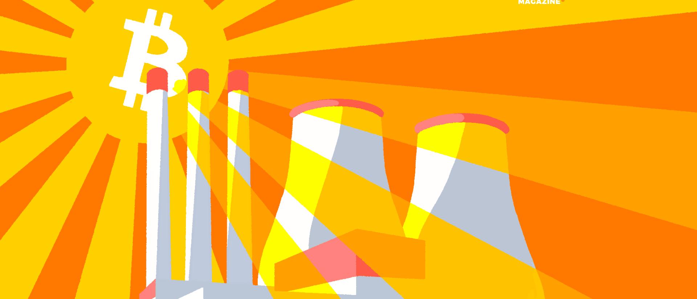

header>

  
  


</header>

This is 🇨🇿 Czech translation of <a href="https://bitcoinmagazine.com/business/bitcoin-mining-at-nuclear-power-plants">this article</a> 
by <a href="https://twitter.com/purugyl">Puru Goyal</a> & Tina Torres, published on Jul12/2022 
<a href="https://twitter.com/BitcoinMagazine">@BitcoinMagazine</a> / Translated with 🧡 @745935 by <a href="https://twitter.com/nekonecnik">@nekonecnik</a> 

# MŮŽE TĚŽBA BITCOINU ZAJISTIT DOSTATEK JADERNÉ ENERGIE ZDARMA?

Představme si jadernou elektrárnu, která v místě integruje těžbu bitcoinu. Jaká bude její ziskovost ve srovnání se standardním provozem?

## ---
<big>Autoři: <a href="https://twitter.com/purugyl">Puru Goyal</a> & Tina Torres 
 Původní článek: <a href="https://bitcoinmagazine.com/business/bitcoin-mining-at-nuclear-power-plants">CAN BITCOIN MINING 
  MAKE NUCLEAR ENERGY ABUNDANT AND FREE?</a>
 Přeložil: <a href="https://twitter.com/nekonecnik">@nekonecnik</a> <a href="https://sifrant.github.io/jednadvacet/support" style="text-decoration: none">🧡</a>
<!--
 Korektura / konzultace: <a href="https://twitter.com/@SatsJoseph">@SatsJoseph</a>
-->
</big>
  

  <footer>
    

    
  </footer>

